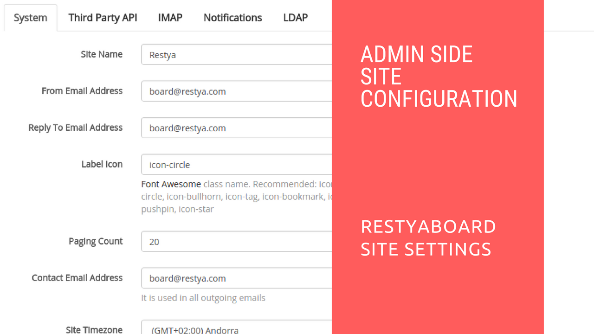
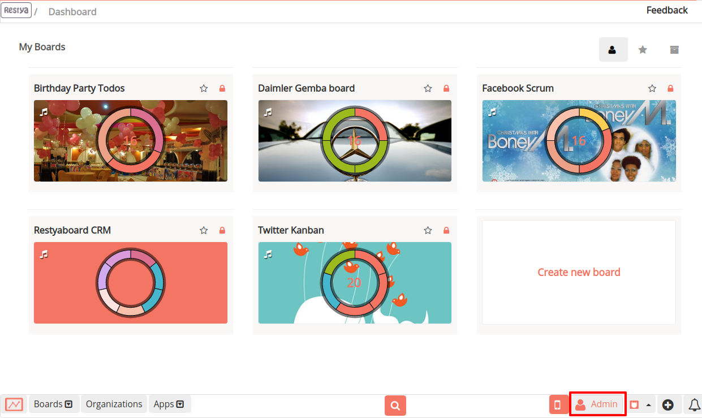
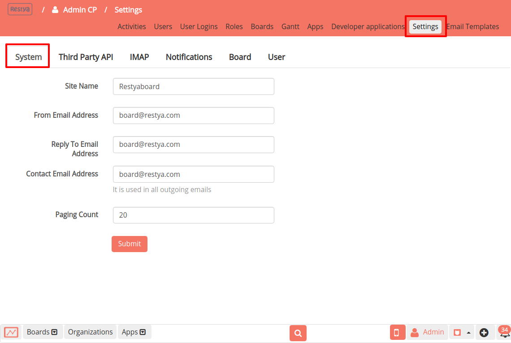

#  Configuration of Site Settings from Admin

## Introduction

This document contains information about how to configure your Restyaboard site from admin panel and you can configure your Restyaboard site name, contact Email Address and you can also configure Third Party API keys like Dropbox App Key and Flickr API Key.

### What you'll learn

*   How to configure third party API keys
*   How to configure IMAP
*   How to configure Restyaboard site name
*   How to configure auto subscription when the users added to the board or card
*   How to configure email notifications and desktop notification

## Video Tutorial

For step-by-step instructions on Configuration of Site Settings from Admin, refer [YouTube video](https://www.youtube.com/watch?v=Fj1ynmT1htU "Watch video on Configuration of Site Settings from Admin")

## Login to admin panel

*   Login as admin and goto the admin panel by clicking the admin cp button in the footer
    
    
*   In the header of the admin panel, please click the settings link for configuring the Restyaboard site
    
    
*   In admin panel, you can configure Restyaboard site on each category like third party API keys, IMAP, Notifications, Users

## Configure System

*   `From Email Address` is the email address which will send all the email for the Restyaboard.
    
*   `Reply To Email Address` is the email address, which will be handling the emails sent to the Restyaboard.
    
*   `Contact Email Address` is the email address, which will be used as the contact for the Restyaboard.
    
*   `Paging Count` is the limit which is used for showing the large number of activities in the given limit with multiple pages

## Configure Third Party API

*   [Dropbox App Key](https://www.dropbox.com/developers/apps/ "Get Dropbox App Key"), which will allow you to access your account in the Dropbox and load the card attachment files directly from Dropbox
    
*   [Flickr API Key](https://www.flickr.com/services/apps/ "Flickr API Key"), which will allow you to set the custom background images for the board directly from Flickr

*   [Unsplash API Key](https://unsplash.com/developers "Unsplash API Key"), which will allow you to set the custom background images for the board directly from Unsplash

## Configure IMAP

*   `IMAP` is the mail service which is used to create cards in the particular board by mailing to the board email and you can also comment on the card by sending mail to the card email and you can add an attachment to the card by attaching the files or images with mail to the card email generated by IMAP configuration
    
    For more details, please refer [IMAP Documentation](https://restya.com/board/docs/imap/ "IMAP Documentation")

## Configure Notifications

*   `Auto subscription to the board` is used to subscribe the members to the board while they were added as a board member.
    
*   `Auto subscription to the card` is used to subscribe the members to the card while they were added as the card member.
    
*   `Email notification` value is used to set the Email Notification for the users while they are added and the users can change their email notifications in their profile page.
    
    For more details about the user email notifications, please refer [Email notification Documentation](https://restya.com/board/docs/restyaboard-email-notification/ "Email Notification Documentation").
    
*   `Desktop notification` value is used to set the Desktop Notification for the users while they are added and the users can change their desktop notifications in their profile page.
    
    You can also configure the sublevels of the user desktop notification of the user.
    
    For more details about the user desktop notifications, please refer [Desktop Notification Documentation](https://restya.com/board/docs/desktop-notifications/ "Desktop Notification Documentation").

## Configure Board

*   [Label Icons](https://fontawesome.com/v3.2.1/icons/ "Configure Label Icons") are used to customize the icons that are shown in front of the card for representing the added labels in the card.
    
*   `Default Card Open` value is used to set the opening view of the card in the board page when they are clicked.
    
*   `Allowed File Extensions`, which will only allow the entered extensions to be uploaded in the card as attachments

## Configure User

*   `Two Way Factor Authentication` provided by [Google Authenticator app](https://support.google.com/accounts/answer/1066447?hl=en "https://support.google.com/accounts/answer/1066447?hl=en"), which will give the options to the users to set the two way factor authentication for their accounts and the users can enable or disable this option in their profile page.
    
*   `Site Timezone` for the Restyaboard site, which will be added as the user timezone when a new user added and the users can also change their timezone in their profile page
    
*   `Default Language` for the Restyaboard site, which is used to set the language for the users while they are added to the Restyaboard and the users can also change their language in their profile page

## Configure App settings

**If you have additional plugins installed, refer**

1.  [LDAP app configuration](https://restya.com/board/docs/ldap/)
2.  [Elasticsearch app search configuration](https://restya.com/board/docs/search/)