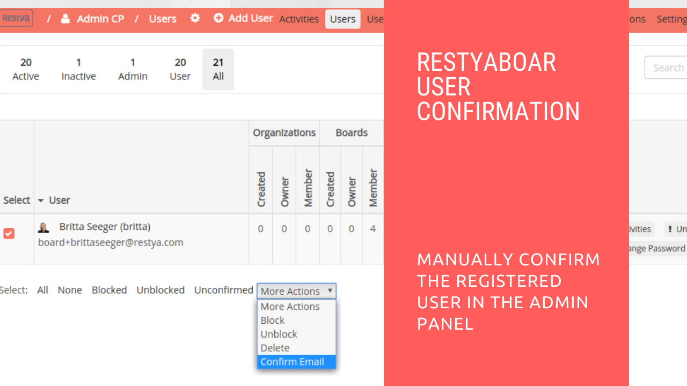

# Manually confirming the registered users in the admin panel of Restyaboard

## Introduction

[Restyaboard](https://restya.com/board) is an open source alternative to Trello, but with smart additional features like offline sync, diff /revisions, nested comments, multiple view layouts, chat, and more. And since it is self-hosted, data, privacy, and IP security can be guaranteed.

Restyaboard is more like an electronic sticky note for organizing tasks and todos. Apart from this, it is ideal for Kanban, Agile, Gemba board and business process/workflow management. It can be extended with [productive plugins](https://restya.com/board/apps "productive plugins")

Today, several universities, automobile companies, government organizations, etc from across Europe take advantage of Restyaboard.

This document contains information about how to manually confirm the registered user in the admin panel in Restyaboard site.

### What you'll learn

*   How to confirm users in the admin panel

## Video Tutorial

For step-by-step instructions on Confirmation of the registered user in the admin panel of Restyaboard, refer [YouTube video](https://www.youtube.com/watch?v=_hw8Gkht4Js "Watch video on Confirmation of the registered user in the admin panel of Restyaboard")

  

## Manually confirming the registered users in the admin panel of Restyaboard

*   Goto your Restyaboard login page and sign in with admin credentials.
    
*   After login, go to the admin panel by clicking the `admin cp` button in the footer.
    
*   In the `admin panel`, click the `Users` link in the heading to go to the users listing page.
*   In users listing page, please select the user you want to confirm and click the `More Actions` option in the bottom and click `Confirm Email` option to confirm the email of the registered user
*   Click `OK` on the alert box to confirm the registered user email.
    
*   After confirming the email of the registered user, please click the `Unblock` button in the user for allowing the user to access the Restiya Board.