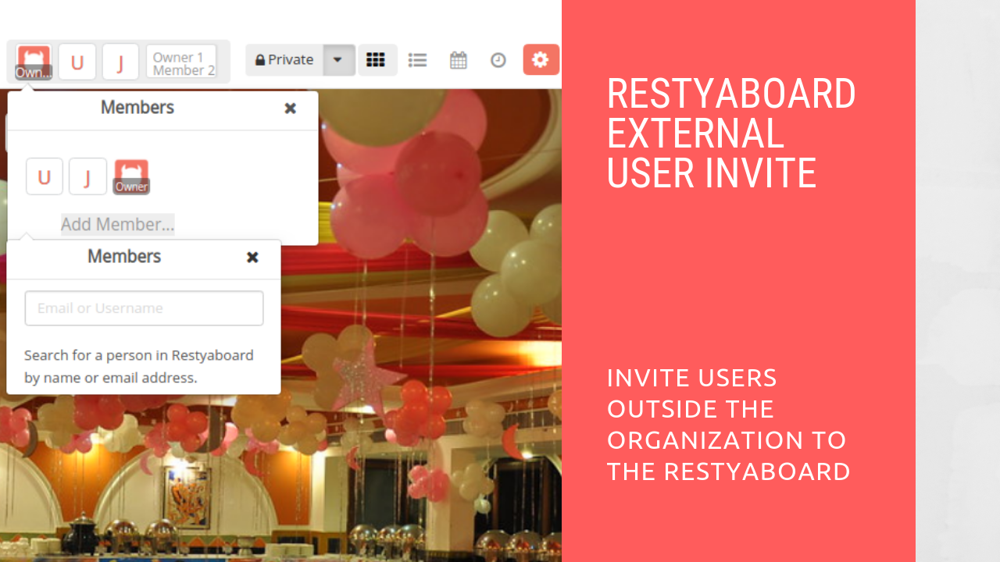
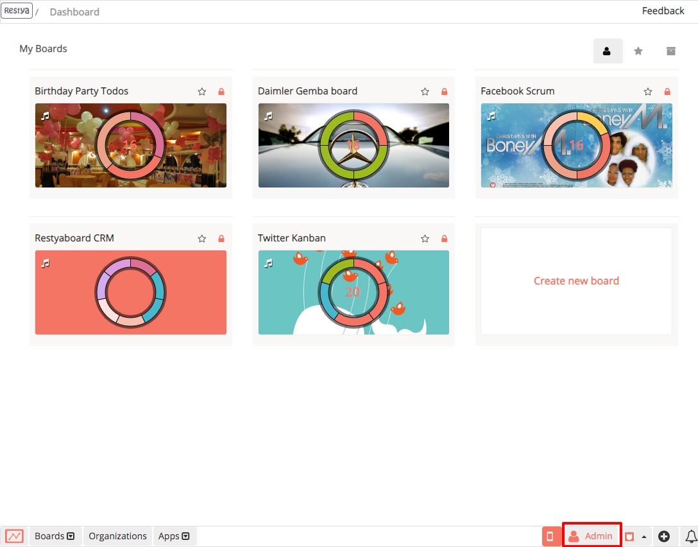
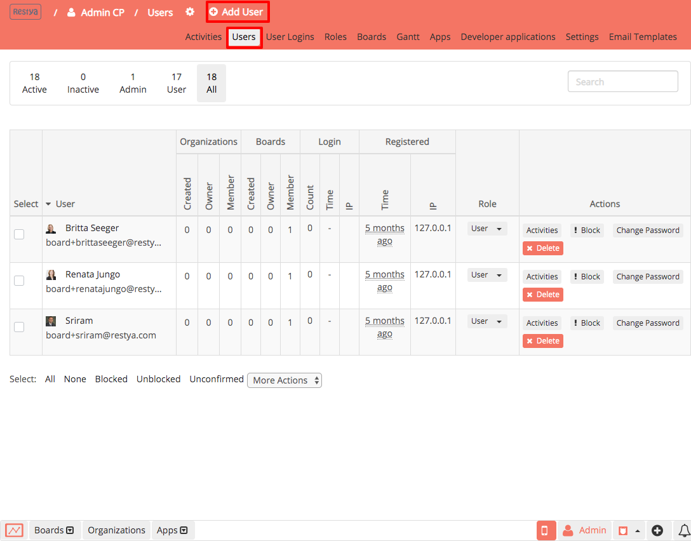
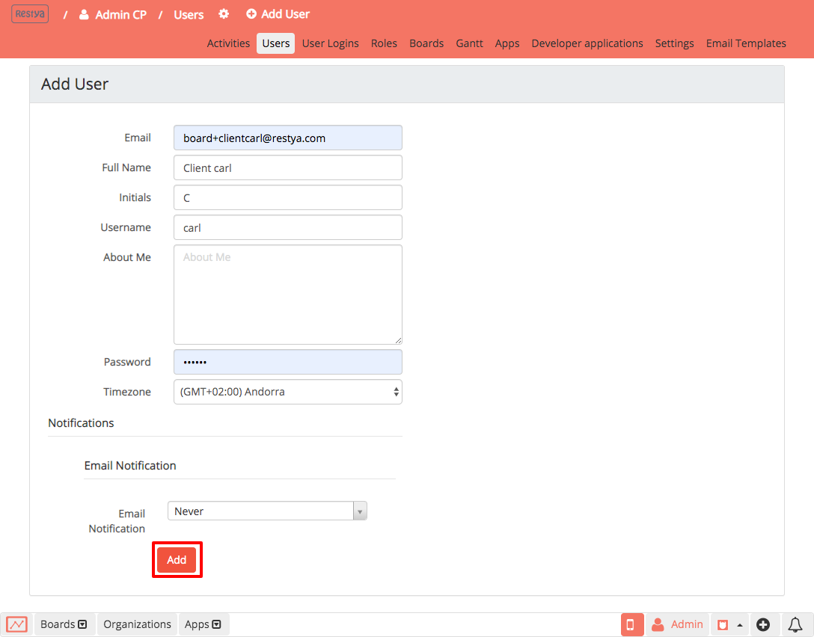
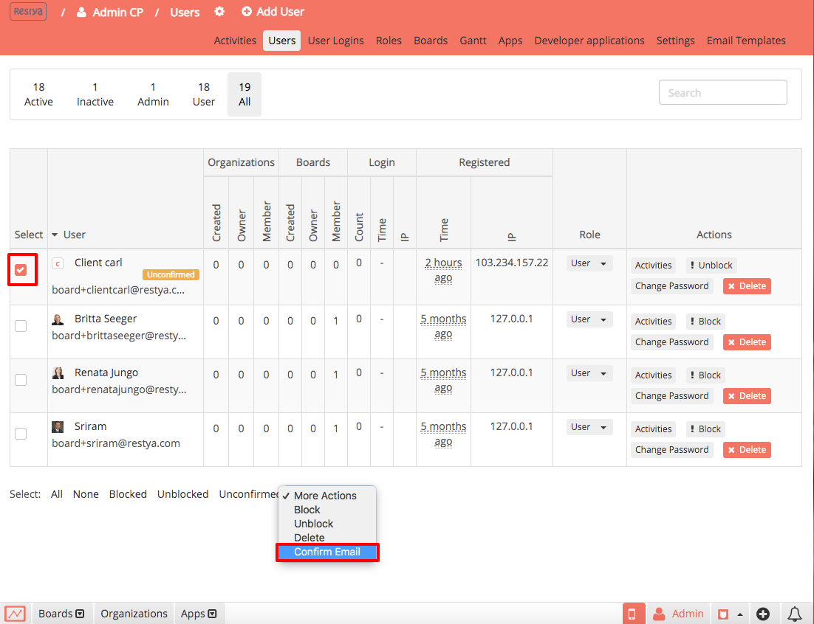
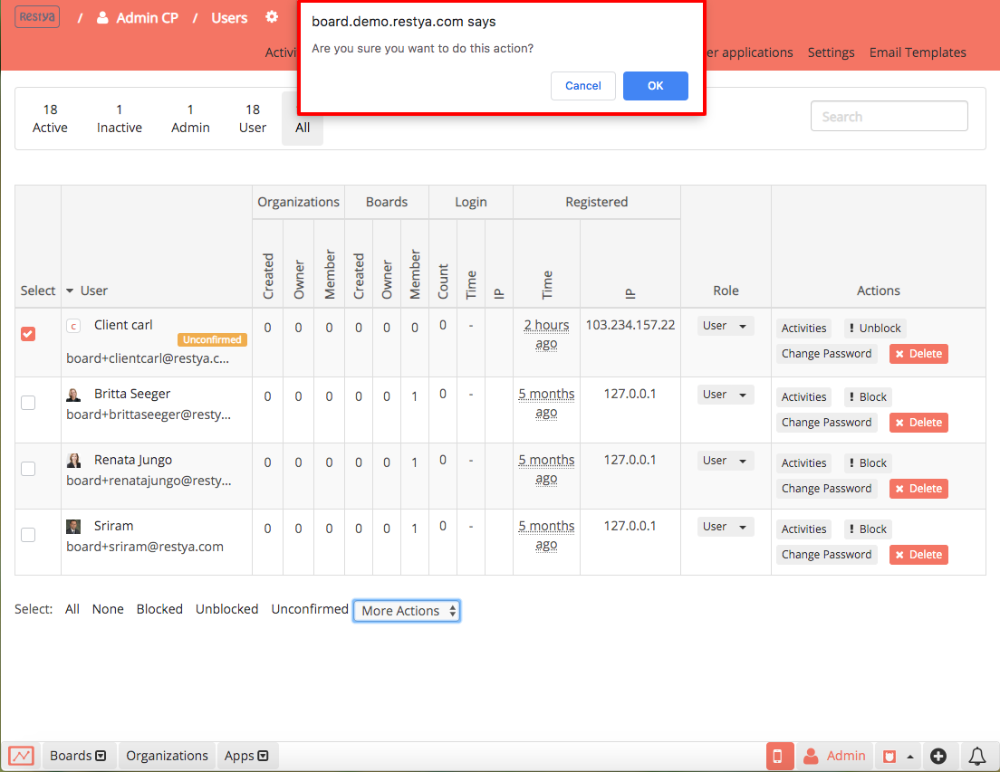
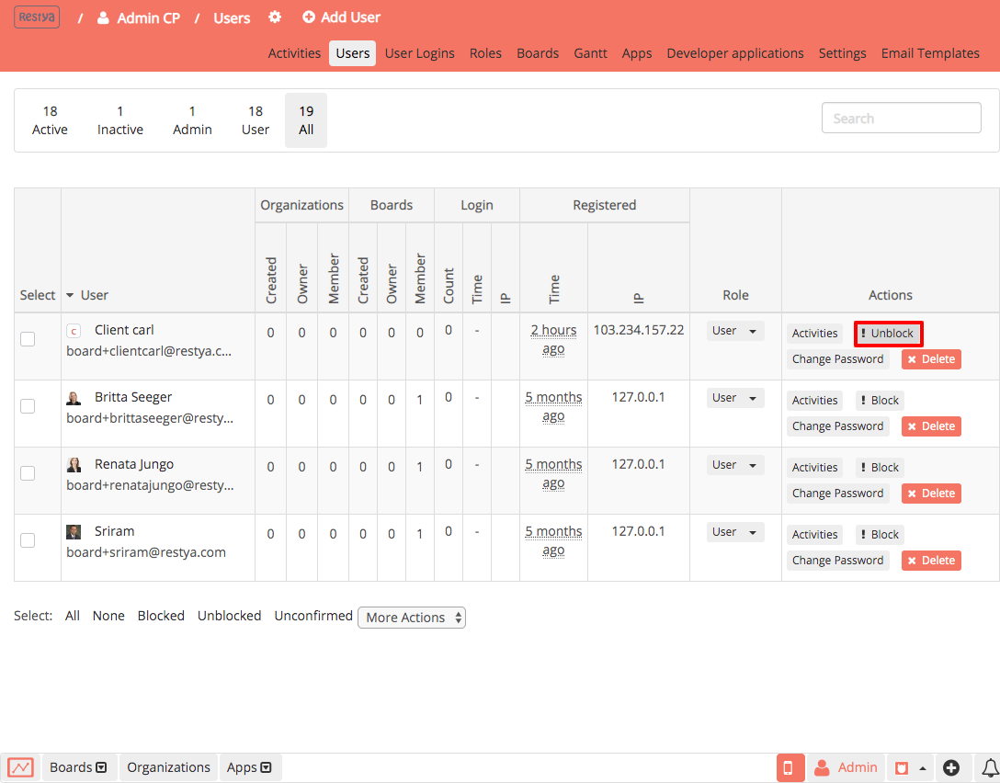
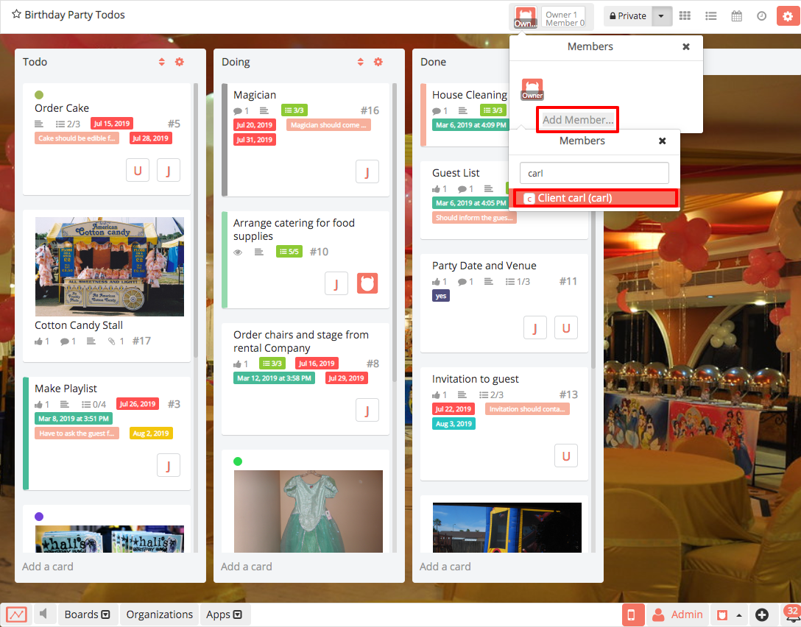
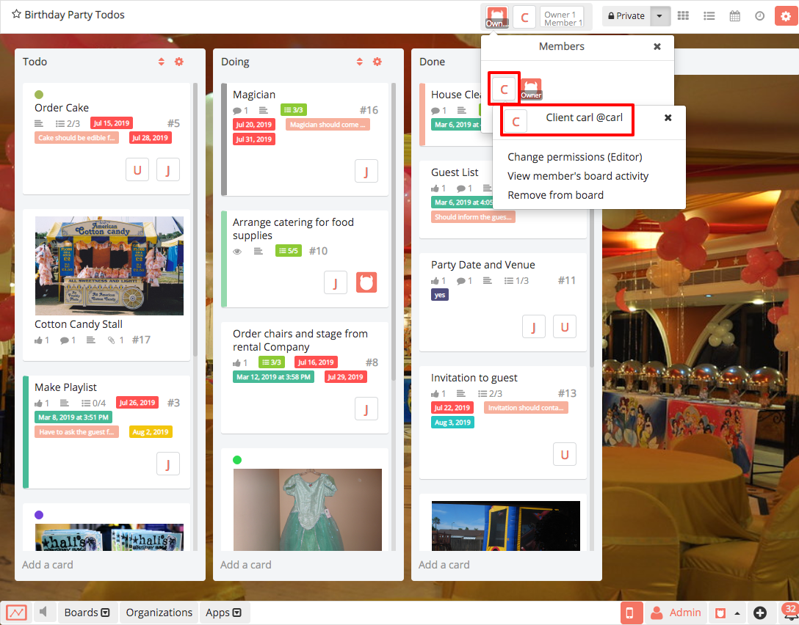

# Inviting external users to Restyaboard

## Introduction

[Restyaboard](https://restya.com/board) is an open source alternative to Trello, but with smart additional features like offline sync, diff /revisions, nested comments, multiple view layouts, chat, and more. And since it is self-hosted, data, privacy, and IP security can be guaranteed.

Restyaboard is more like an electronic sticky note for organizing tasks and todos. Apart from this, it is ideal for Kanban, Agile, Gemba board and business process/workflow management. It can be extended with [productive plugins](https://restya.com/board/apps "productive plugins")

Today, several universities, automobile companies, government organizations, etc from across Europe take advantage of Restyaboard.

This document contains information about how to invite users outside the organization to your board in Restyaboard site.

### What you'll learn

*   How to add users outside the organization from admin panel
*   How to confirm users in the admin panel
*   How to invite external users to the board in your Restyaboard site

## Video Tutorial

For step-by-step instructions on Inviting external users to Restyaboard, refer [YouTube video](https://www.youtube.com/watch?v=4gj1AoDAtBs "Watch video on Inviting external users to Restyaboard")

## Login to admin panel

*   Login as admin and go to the admin panel by clicking the admin cp button in the footer
    
    
*   In the header of the admin panel, please click the users link to add the user into your Restyaboard site. You can add the users by clicking the `Add User` option in the header.
    
    

## Add External User

Provide required user details in the `Add User` form and tap the `Add` button to include an external user to your Restyaboard.

## Confirm User Email

*   Select the added external user from the user listing page and tap `More Actions` from the bottom of the page. Thereafter, choose the `Confirm Email` option from the drop-down
    
    
*   Click `OK` on the alert box to confirm the added external user email.
    
    

## Unblock Added User

Click `Unblock` option to unblock the added external user

## Invite External user to the board

Go to the board where you want to invite the external user. Click the member's list from the board page header and search for the external user name whom you want to invite to the board. Select the username to add the external user as a member to the board.

## Board member details

You can check the added external user’s details by clicking the member’s list from the board page header. Click on the added member to view his role. Also, you can view their activity on the board.

