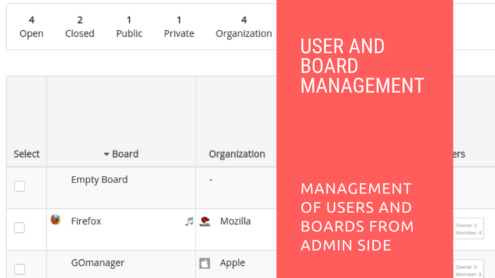

# Restyaboard Users and Boards Management

## Introduction

[Restyaboard](https://restya.com/board) is an open source alternative to Trello, but with smart additional features like offline sync, diff /revisions, nested comments, multiple view layouts, chat, and more. And since it is self-hosted, data, privacy, and IP security can be guaranteed.

Restyaboard is more like an electronic sticky note for organizing tasks and todos. Apart from this, it is ideal for Kanban, Agile, Gemba board and business process/workflow management. It can be extended with [productive plugins](https://restya.com/board/apps "productive plugins")

Today, several universities, automobile companies, government organizations, etc from across Europe take advantage of Restyaboard.

This document contains information about how to manage boards and users from admin panel in Restyaboard.

### What you'll learn

*   How to Manage Users from Admin Panel in Restyaboard?
*   How to Manage Boards from Admin Panel in Restyaboard?

## Video Tutorial

For step-by-step instructions on Restyaboard Users and Boards Management, refer [YouTube video](https://www.youtube.com/watch?v=s976ilb_j4Q "Watch video on Restyaboard Users and Boards Management")

## Restyaboard Users Management

1.  After login as admin, please goto users listing page for user management
2.  You can add a user and confirm email of the added user and you can `Reset Password` , `Block user` , `Change Roles` for the user and you can search for the particular user by username.

## Restyaboard Boards Management

1.  After login as admin, please goto Boards listing page for board management
2.  You can able to change the `Board Visibility`, `Close Board`, `Reopen Board` and search for the particular board by board name.