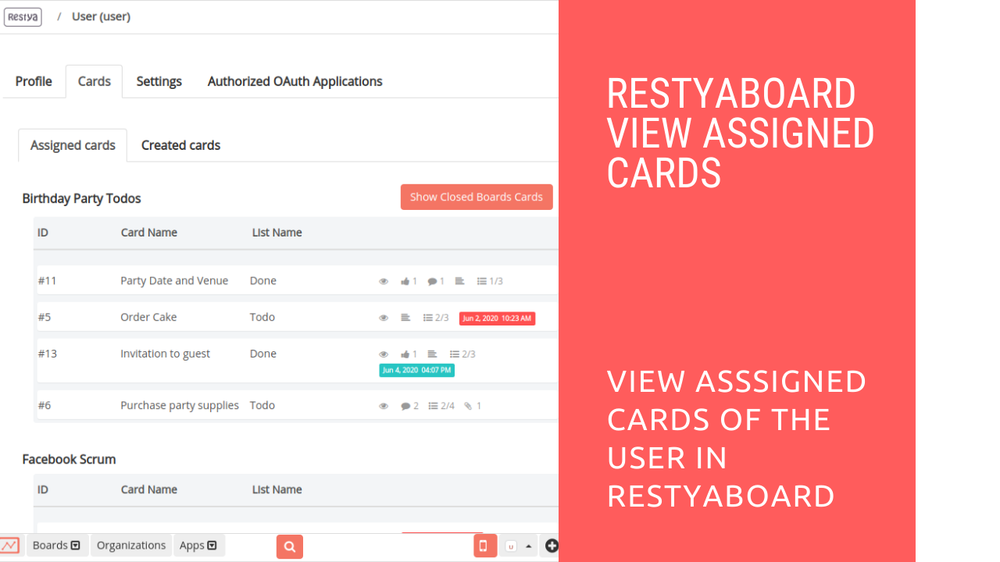

# Restyaboard View the Assigned Cards to the User from All the Boards

## Introduction

[Restyaboard](https://restya.com/board) is an open source alternative to Trello, but with smart additional features like offline sync, diff /revisions, nested comments, multiple view layouts, chat, and more. And since it is self-hosted, data, privacy, and IP security can be guaranteed.

Restyaboard is more like an electronic sticky note for organizing tasks and todos. Apart from this, it is ideal for Kanban, Agile, Gemba board and business process/workflow management. It can be extended with [productive plugins](https://restya.com/board/apps "productive plugins")

Today, several universities, automobile companies, government organizations, etc from across Europe take advantage of Restyaboard.

This document contains information about how to view the assigned cards to the user from all the boards on Restyaboard.

### What you'll learn

*   How to View the Assigned Cards to the User from All the Boards on Restyaboard?

## Video Tutorial

For step-by-step instructions on Restyaboard View the Assigned Cards to the User from All the Boards, refer [YouTube video](https://www.youtube.com/watch?v=r7njxuihiZ8 "Watch video on Restyaboard View the Assigned Cards to the User from All the Boards")

## Restyaboard View the Assigned Cards to the User from All the Boards

1.  Goto your Restyaboard login page and sign in with user credentials.
2.  After login, go to the `User Profile` by clicking the user icon in the footer and click the `Profile` option in the user dropdown menu.
3.  In the user profile page, click the `Cards` tab to view the `Assigned Cards of the User` from all the boards in Restyaboard.
