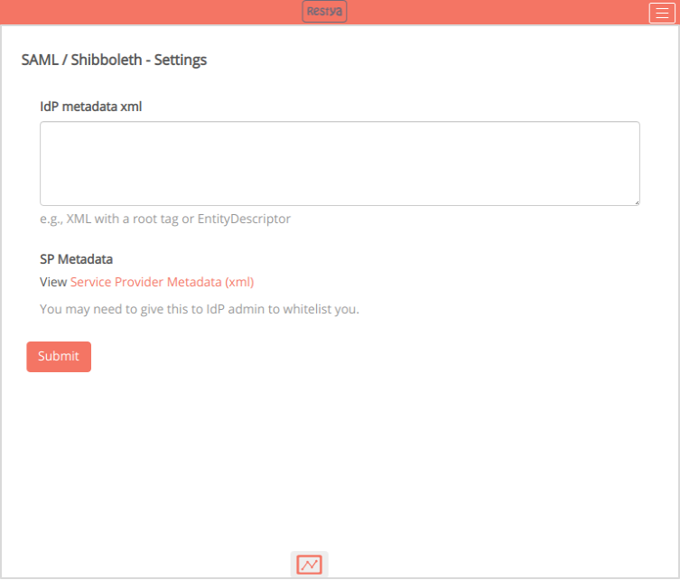
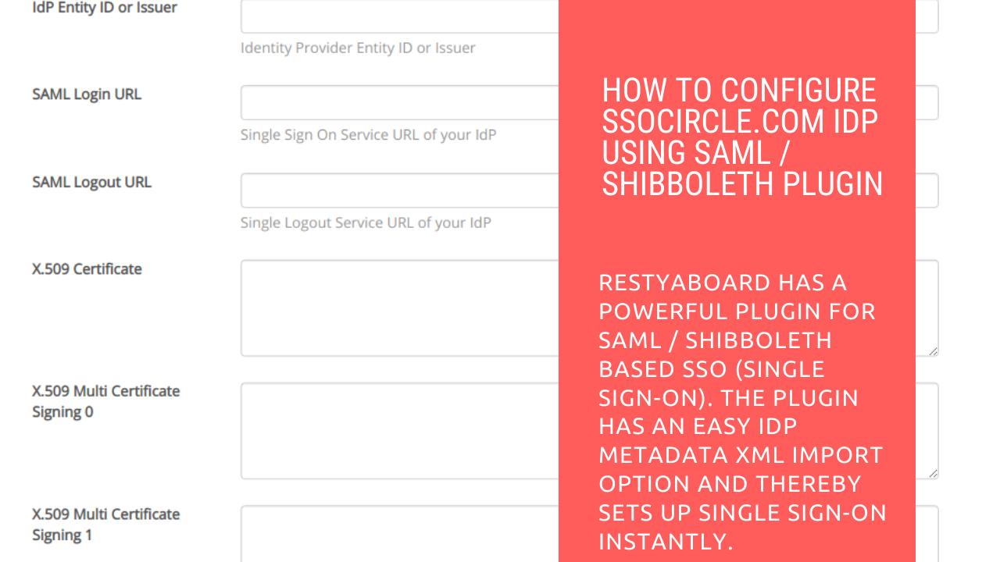
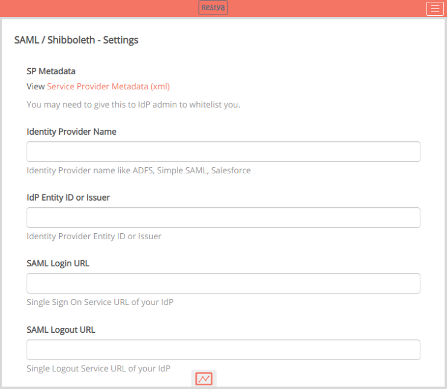
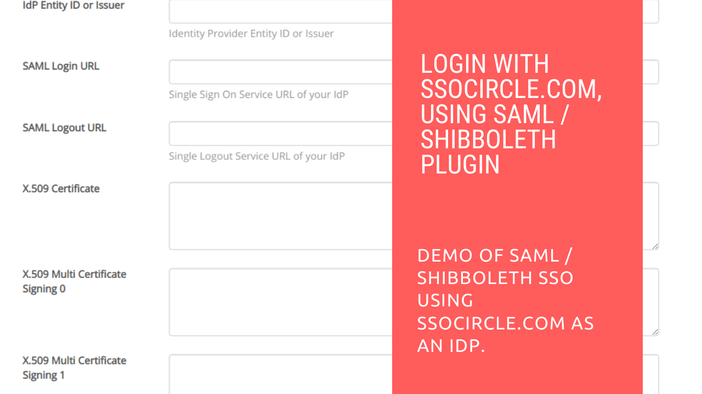

# SAML / Shibboleth

## Introduction

#### How SAML Works

SAML SSO operates by passing the identity of the user from one location (the identity provider) to another (the service provider). It is achieved by the exchange of XML documents that are digitally signed.

#### SAML Initial Setup

 

**IdP metadata XML**

*   It is an XML document containing the information required for SAML-enabled identity or service provider interaction. This document includes e.g., Endpoint URLs, Supported Bindings information, IDs, and Public Keys.

**SP Metadata**

*   The metadata from the service provider includes keys, services, and URLs that describe the Restyaboard SAML endpoints.

**Identity Provider Name**

*   It is the name identifier that is included in the metadata. Identity Provider names like ADFS, Simple SAML, Salesforce.

## Video - Configuring SSOCircle.com IdP

For step-by-step instructions on SAML / Shibboleth Plugin Configuration, refer [YouTube video](https://www.youtube.com/watch?v=PjqYWjNUOWk "Watch video on SAML / Shibboleth Plugin Configuration")

 

## SAML Configuration

**IdP Entity ID or Issuer**

*   It is the unique identifier of the Identity Provider or Issuer.

**SAML Login URL**

*   Single Sign On Service URL of your Identity Provider.

**SAML Logout URL**

*   Single Logout Service URL of your Identity Provider.

 

**X.509 Certificate**

*   The X.509 certificates are the Identity Provider certificates that a SAML configuration uses.

**X.509 Multi Certificate Signing**

*   SAML signing certificates ensure that messages are coming from the expected identity and service providers. The SAML certificate is used to sign SAML requests, responses, and assertions from the service to relying applications, such as WebEx or Google Apps.

**X.509 Multi Certificate Encryption**

*   SAML encryption certificates ensure that messages are coming from the expected identity and service providers with authenticity and confidentiality.

## x509 certificate for SP

If the SAML environment requires sign or encrypt support, place the x509 cert and the private key in the folder `/usr/share/nginx/html/restyaboard/server/php/plugins/SamlLogin/libs/vendor/saml/certs`. Note that the filenames must be `sp.crt` and `sp.key`.

*   `sp.crt` - The public cert of the SP
*   `sp.key` - The private key of the SP

For generating the self signed certificates for SAML, you may use the link [https://www.samltool.com/self\_signed\_certs.php](https://www.samltool.com/self_signed_certs.php)

For self signed certificate genertaion, you must provide your country name, State or Province Name, Organization Name, Common Name, the domain.

## Video - SSO Login Using SSOCircle.com

For step-by-step instructions on Login with SSOCircle.com, using SAML / Shibboleth Plugin, refer [YouTube video](https://www.youtube.com/watch?v=h37Q43iwhwQ "Watch video on Login with SSOCircle.com, using SAML / Shibboleth Plugin")

