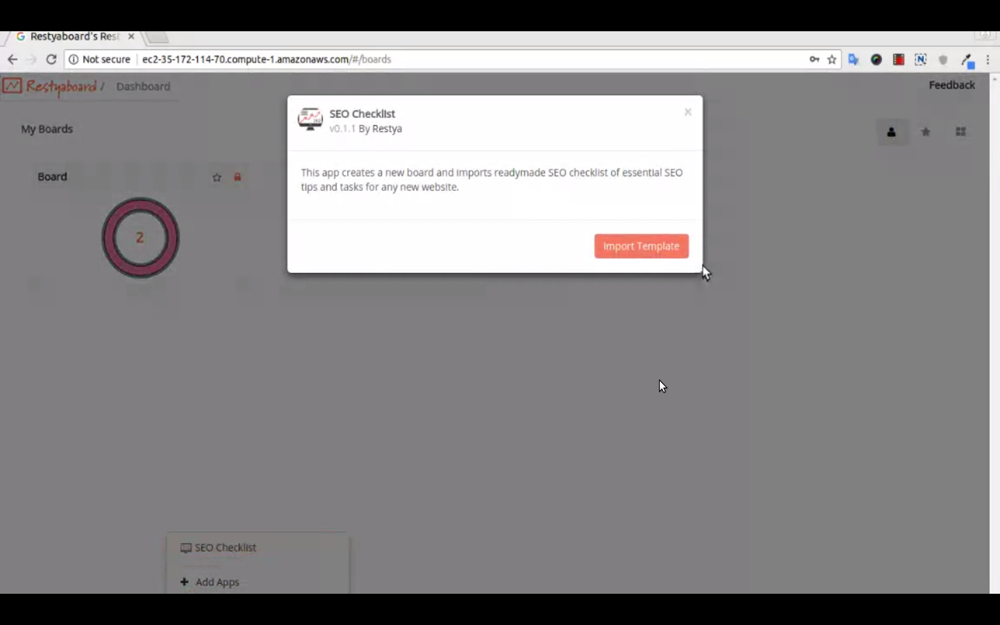

# SEO Checklist Plugin Installation

## Introduction

[Restyaboard](https://restya.com/board) is an open source alternative to Trello, but with smart additional features like offline sync, diff /revisions, nested comments, multiple view layouts, chat, and more. And since it is self-hosted, data, privacy, and IP security can be guaranteed.

Restyaboard is more like an electronic sticky note for organizing tasks and todos. Apart from this, it is ideal for Kanban, Agile, Gemba board and business process/workflow management. It can be extended with [productive plugins](https://restya.com/board/apps "productive plugins")

Today, several universities, automobile companies, government organizations, etc from across Europe take advantage of Restyaboard.

This document contains information about instruction on SEO Checklist Plugin Installations.

### What you'll learn

*   How to install the SEO Checklist plugin in the Restyaboard

## Video Tutorial

For step-by-step instructions on SEO Checklist Plugin Installations, refer [YouTube video](https://www.youtube.com/watch?v=HBD6fgikH0A "Watch video on SEO Checklist Plugin Installations")

## SEO Checklist Plugin Installation

1.  Download [SEO Checklist app](https://restya.com/board/apps/r_seo_checklist "SEO Checklist app")
2.  Goto your Restyaboard installation root directory. e.g., directory: `/usr/share/nginx/html/restyaboard/`
3.  Extract/unzip the downloaded plugin zip into the restyaboard installation path. e.g., `/usr/share/nginx/html/restyaboard/`
4.  Give file permission to extracted files. e.g., `chmod -R 0777 client/apps/r_seo_checklist/`
5.  Goto `client/apps/r_seo_checklist/` directory, to configure the plugin using app.json.
6.  After the above process, clear the browser cache and login again to view the installed SEO Checklist plugin on your Restyaboard.