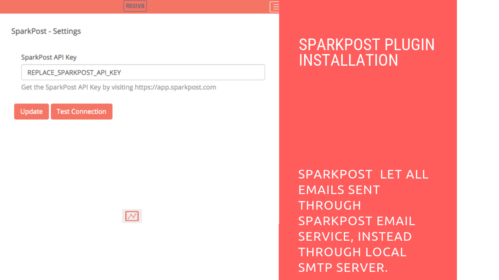

# SparkPost Plugin Installation

## Introduction

[Restyaboard](https://restya.com/board) is an open source alternative to Trello, but with smart additional features like offline sync, diff /revisions, nested comments, multiple view layouts, chat, and more. And since it is self-hosted, data, privacy, and IP security can be guaranteed.

Restyaboard is more like an electronic sticky note for organizing tasks and todos. Apart from this, it is ideal for Kanban, Agile, Gemba board and business process/workflow management. It can be extended with [productive plugins](https://restya.com/board/apps "productive plugins")

Today, several universities, automobile companies, government organizations, etc from across Europe take advantage of Restyaboard.

This document contains information about how to install and configure SparkPost app in Restyaboard.

### What you'll learn

*   How to install SparkPost app in Restyaboard
*   How to configure SparkPost app in Restyaboard

## Video Tutorial

For step-by-step instructions on installation and configuration of Sparkpost Plugin Installation in Restyaboard, refer [YouTube video](https://www.youtube.com/watch?v=5BSDg6RTsV4 "Watch video on SparkPost Plugin Installation in Restyaboard")

## SparkPost Plugin Installation

1.  Download [SparkPost App](https://restya.com/board/apps/r_sparkpost "SparkPost App")
2.  Goto Restyaboard installation root directory.e.g., directory: `/usr/share/nginx/html/restyaboard/`
3.  Unzip the purchased SparkPost app into your root directory
4.  Open a command prompt in `/usr/share/nginx/html/restyaboard/client/apps/r_sparkpost/` path and give the executable permission to the shell file `sparkpost.sh`.e.g.,`chmod +x sparkpost.sh`
5.  Run the shell script file. e.g., `./sparkpost.sh`
6.  Configure SparkPost on `http://{YOUR_SERVER_NAME}/#/apps/r_sparkpost` path in your Restyaboard server.
7.  Finally, clear the browser cache, and log in again to view the installed SparkPost app on your Restyaboard.