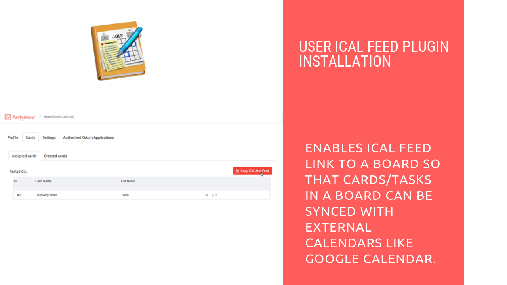

# User iCal Feed Plugin Installation

## Introduction

[Restyaboard](https://restya.com/board) is an open source alternative to Trello, but with smart additional features like offline sync, diff /revisions, nested comments, multiple view layouts, chat, and more. And since it is self-hosted, data, privacy, and IP security can be guaranteed.

Restyaboard is more like an electronic sticky note for organizing tasks and todos. Apart from this, it is ideal for Kanban, Agile, Gemba board and business process/workflow management. It can be extended with [productive plugins](https://restya.com/board/apps "productive plugins")

Today, several universities, automobile companies, government organizations, etc from across Europe take advantage of Restyaboard.

This document contains information about how to install and use the User iCal Feed plugin

### What you'll learn

*   How to install the User iCal Feed plugin in the Restyaboard?
*   How to use User iCal Feed plugin?

## Video Tutorial

For step-by-step instructions on User iCal Feed Plugin Installation from Admin, refer [YouTube video](https://www.youtube.com/watch?v=IohrcWtcnyI "Watch video on User iCal Feed Plugin Installation from Admin")

## User iCal Feed Plugin Installation

1.  Download [User iCal Feed app](https://restya.com/board/apps/r_user_ical_feed "User iCal Feed app")
2.  Goto your Restyaboard installation root directory. e.g., directory: `/usr/share/nginx/html/restyaboard/`
3.  Extract/unzip the downloaded plugin zip into the Restyaboard installation path
4.  Give file permission to extracted files. e.g., `chmod -R 0777 client/apps/r_user_ical_feed/`
5.  Execute the `r_user_ical_feed.sql` in your Restyaboard database, located in `client/apps/r_user_ical_feed/sql/` directory
6.  Add the line `rewrite ^/ical/([0-9]*)/([a-z0-9]*).ics$ /server/php/plugins/UseriCalFeed/ical.php?user_id=$1&hash=$2 last;` after `line 23` in the `Restyaboard configuration file` which is in the `/etc/nginx/conf.d` folder and restart the `Nginx` by `systemctl restart nginx`
7.  After the above process, clear the browser cache and login again to view the installed User iCal Feed plugin on your Restyaboard.

## How to use User iCal Feed plugin

1.  After login, please click the user profile or user icon in the footer menu and click the `profile` options and it will direct to the user profile page.
2.  Now click the tab `Cards` and under the tab content, you can see the `Copy iCal User Feed` button.
3.  After clicking the button, the dropdown will appear and the `iCal feed URL` will be in the input and you can copy the url and enter it in the URL for Google calendar option.