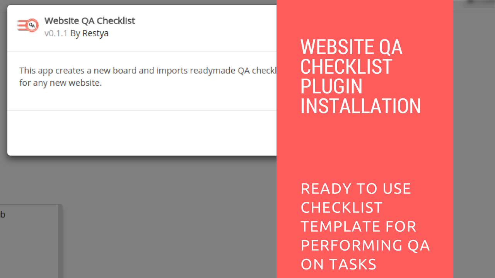

# Website QA Checklist Plugin Installation

## Introduction

[Restyaboard](https://restya.com/board) is an open source alternative to Trello, but with smart additional features like offline sync, diff /revisions, nested comments, multiple view layouts, chat, and more. And since it is self-hosted, data, privacy, and IP security can be guaranteed.

Restyaboard is more like an electronic sticky note for organizing tasks and todos. Apart from this, it is ideal for Kanban, Agile, Gemba board and business process/workflow management. It can be extended with [productive plugins](https://restya.com/board/apps "productive plugins")

Today, several universities, automobile companies, government organizations, etc from across Europe take advantage of Restyaboard.

This document contains information about how to install the Website QA Checklist plugin.

### What you'll learn

*   How to install the Website QA Checklist plugin in the Restyaboard

## Video Tutorial

For step-by-step instructions on Website QA Checklist Plugin Installation, refer [YouTube video](https://www.youtube.com/watch?v=1c46b8BjEpc "Watch video on Website QA Checklist Plugin Installation")

## Website QA Checklist Plugin Installation

1.  Download [Website QA Checklist app](https://restya.com/board/apps/r_website_qa_checklist "Website QA Checklist app")
2.  Goto your Restyaboard installation root directory. e.g., directory: `/usr/share/nginx/html/restyaboard/`
3.  Extract/unzip the downloaded plugin zip into the Restyaboard installation path. e.g., `/usr/share/nginx/html/restyaboard/`
4.  Give file permission to extracted files. e.g., `chmod -R 0777 client/apps/r_website_qa_checklist/`
5.  Goto `client/apps/r_website_qa_checklist/` directory, to configure the plugin using app.json.
6.  After the above process, clear the browser cache and login again to view the installed Website QA Checklist plugin on your Restyaboard.