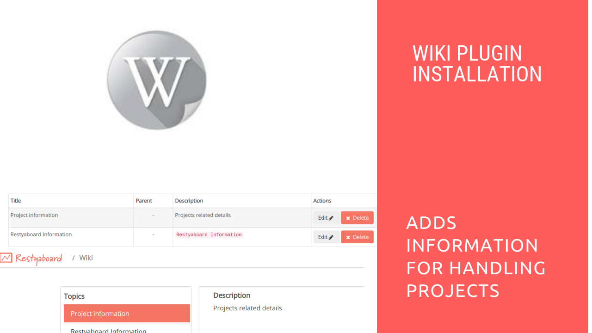

# Wiki Plugin Installation

## Introduction

[Restyaboard](https://restya.com/board) is an open source alternative to Trello, but with smart additional features like offline sync, diff /revisions, nested comments, multiple view layouts, chat, and more. And since it is self-hosted, data, privacy, and IP security can be guaranteed.

Restyaboard is more like an electronic sticky note for organizing tasks and todos. Apart from this, it is ideal for Kanban, Agile, Gemba board and business process/workflow management. It can be extended with [productive plugins](https://restya.com/board/apps "productive plugins")

Today, several universities, automobile companies, government organizations, etc from across Europe take advantage of Restyaboard.

This document contains information about Wiki Plugin Installation and Creation of Wiki in the Restyaboard.

### What you'll learn

*   How to install the Wiki plugin in the Restyaboard?
*   How to create the Wiki in the Restyaboard?

## Video Tutorial

For step-by-step instructions on Wiki Plugin Installation, refer [YouTube video](https://www.youtube.com/watch?v=hA9M0j3V-Z8 "Watch video on Wiki Plugin Installation")

  

## Wiki Plugin Installation

1.  Download [Wiki app](https://restya.com/board/apps/r_wiki "Wiki app")
2.  Goto your Restyaboard installation root directory. e.g., directory:`/usr/share/nginx/html/restyaboard/`
3.  Extract/unzip the downloaded plugin zip into the restyaboard installation path. e.g.,`usr/share/nginx/html/restyaboard/`
4.  Give file permission to extracted files. e.g.,`chmod -R 0777 client/apps/r_wiki/`
5.  Execute the sql file in `client/apps/r_wiki/sql` folder using the command `psql -h localhost -d {DATABASE_NAME} -U {USER_Name} -w < /usr/share/nginx/html/restyaboard/client/apps/r_wiki/sql/r_wiki.sql`
6.  After the above process, clear the browser cache and login again to view the installed `Wiki` plugin on your Restyaboard.

## Creation of Wiki

1.  For creating Wiki, goto`http://{YOUR_SERVER_NAME}/#/apps` path in your Restyaboard server and click the `settings` option in the right side dropdown of the Wiki
2.  Now, the Management page shows and for creating the wiki , please click the Add Wiki button and submit the form
3.  You can add the wiki with existing wiki as the parent wiki
4.  You can see the wiki by clicking the `Wiki` button in the footer and it will directs to the wiki page.