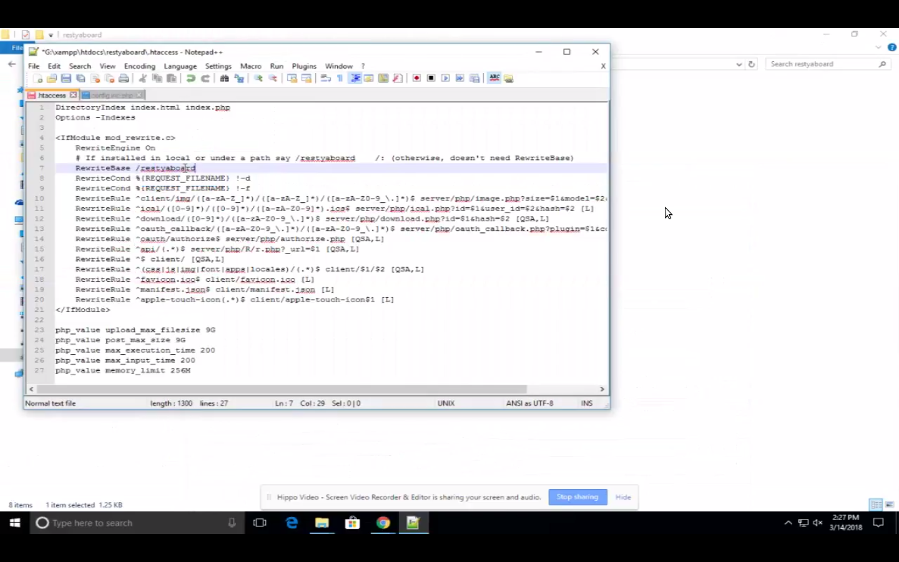

# Manual Installation in windows using XAMPP

## Introduction

[Restyaboard](https://restya.com/board) is an open source alternative to Trello, but with smart additional features like offline sync, diff /revisions, nested comments, multiple view layouts, chat, and more. And since it is self-hosted, data, privacy, and IP security can be guaranteed.

Restyaboard is more like an electronic sticky note for organizing tasks and todos. Apart from this, it is ideal for Kanban, Agile, Gemba board and business process/workflow management. It can be extended with [productive plugins](https://restya.com/board/apps "productive plugins")

Today, several universities, automobile companies, government organizations, etc from across Europe take advantage of Restyaboard.

This document is a step-by-step guide that illustrates how to setup Restyaboard in windows using XAMPP.

### What you'll learn

*   How to install XAMPP server and PostgreSQL?
*   How to install Restyaboard in Windows using XAMPP?

## Video Tutorial

For step-by-step instructions on Install in Windows using XAMPP, refer [YouTube video](https://www.youtube.com/watch?v=AB2IJYuMxTQ "Watch video on Manual Installation in windows using XAMPP")

## Manual Installation of XAMPP server and PostgreSQL

Please skip the steps below, if you have already installed XAMPP server, PostgresQL on your machine

**Installation of XAMPP server:**

*   Download XAMPP via Apache Friends and follow the instructions there: [https://www.apachefriends.org/download.html](https://www.apachefriends.org/download.html "Instruction for XAMPP server installation")
    

**Installation of PostgreSQL:**

*   Download the postgreSQL installer from EnterpriseDB. Download the postgreSQL 11.2 as you might face frequent logout issue. [https://www.enterprisedb.com/downloads/postgres-postgresql-downloads](https://www.enterprisedb.com/downloads/postgres-postgresql-downloads "Instruction for postgreSQL installation")
    
*   Run the installer and follow the on-screen instructions. You may skip the Stack Builder section.
    
*   You will be prompted to **set a password for postgres root user**. By now, postgreSQL has been installed.
    

**Getting postgreSQL to connect with PHP**

*   Please save the below PHP codes as `info.php` file in the XAMPP server html folder. E.g: `C:\xampp\htdocs\info.php`
    
        <?php
        phpinfo();
                  
    
*   Please run the URL `http://localhost/info.php` and Look for `Loaded Configuration File`
    
*   Open php.ini file specified on Loaded Configuration File in `C:\xampp\php`. Uncomment the following lines in `php.ini`
    
        
        extension=php_pdo_pgsql.dll
        extension=php_pgsql.dll
                      
    
*   Restart Apache. Now the PostgreSQL will be accessed by the PHP
    
## Manual Installation of Restyaboard in XAMPP

1.  Download script from `https://github.com/RestyaPlatform/board/releases`, and choose the latest version. e.g., `https://github.com/RestyaPlatform/board/releases/download/v1.7/board-v1.7.zip`
2.  Extract the zip into your apache server root folder. e.g., `C:\xampp\htdocs\`
3.  Create database using the command
    
        psql -U {{YOUR POSTGRES DATABASE USER}} -c 'create database restyaboard’
    
4.  Import SQL using the command
    
        psql -h localhost -d restyaboard -U {{YOUR POSTGRES DATABASE USER}} -W < 'restyaboard_with_empty_data.sql’
    
5.  Change the database credentials in `server/php/config.inc.php`
    *   define('R\_DB\_USER’, 'restya’);
    *   define('R\_DB\_PASSWORD’, 'hjVl2!rGd’);
6.  Give write permission to following directories: `media, tmp/cache, server/php/shell/*.sh & client/img;` can be chmod 655 or 755 or 777 depending upon your server configuration
7.  Use this .htaccess to run it in Apache `https://github.com/RestyaPlatform/board/blob/master/.htaccess`
8.  Rewrite the base name in `https://github.com/RestyaPlatform/board/blob/master/.htaccess#L7` as `/restyaboard`
9.  Write following crons in crontab using `crontab -e` command

#### Example

    */5 * * * * C:\xampp\htdocs\restyaboard\server\php\shell\main.sh