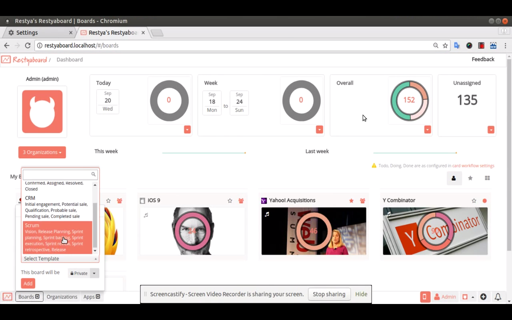

# Workflow Template

## Introduction

[Restyaboard](https://restya.com/board) is an open source alternative to Trello, but with smart additional features like offline sync, diff /revisions, nested comments, multiple view layouts, chat, and more. And since it is self-hosted, data, privacy, and IP security can be guaranteed.

Restyaboard is more like an electronic sticky note for organizing tasks and todos. Apart from this, it is ideal for Kanban, Agile, Gemba board and business process/workflow management. It can be extended with [productive plugins](https://restya.com/board/apps "productive plugins")

Today, several universities, automobile companies, government organizations, etc from across Europe take advantage of Restyaboard.

This document contains information about how to create Workflow Template.

### What you'll learn

*   How to create Workflow templates?

## Video Tutorial

For step-by-step instructions on Workflow Template, refer [YouTube video](https://www.youtube.com/watch?v=_Y8r7auwzOY "Watch video on Workflow Template")

## Workflow Template

#### Predefined Workflow Templates

**Blank**

*   Creates a board with blank template

**Bug**

*   Creates a board with predefined lists to collect, organize, track, and process bugs.

**CRM**

*   Creates a board with predefined lists to manage your sales leads and customer contacts.

**Gemba board**

*   Creates a board with predefined lists to manage your projects and pull in the right stakeholders at every phase so bottlenecks don’t inhibit progress.

**Kanban board**

*   Creates a board with predefined lists to complete projects as productively as possible while ensuring the projects that the users work on are as valuable as possible.

**Todo**

*   Creates a board with predefined lists to manage your everyday tasks.

#### Steps for creating workflow templates

1.  Goto your Restyaboard installation root directory. e.g., directory: `/usr/share/nginx/html/restyaboard/`
2.  Create board template JSON file manually, you can refer the below example.
3.  Copy that JSON file and paste it into the `workflow_templates` folder which is available in `client/js/workflow_templates` directory
4.  Give file permission to that JSON file e.g., `chmod -R 0777 client/js/workflow_templates/{TEMPLATE_FILE}`
5.  After the above process, clear the browser cache and login again.
6.  Now you can create board with your customized template.

#### JSON Example

    {
    "name": "Todo", 
    "lists": \[
        "Todo",
        "Doing",
        "Done"
        \]
    }